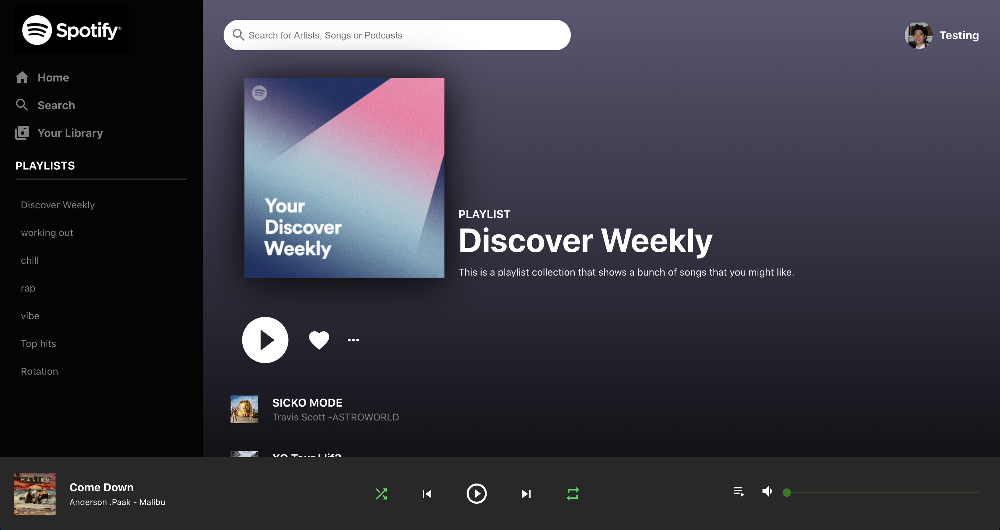

# About

This is a front-end Spotify clone that utilizes the Spotify API in order to pull account information for display. 

# Technologies

The technologies used to build this website include:

- HTML5
- CSS3
- REACT
- REACT-CONTEXT-API

# More info

This website includes 2 main pages:

1. Login
2. Home

### Login

The login page utilizes the Spotify API in order to gain access to a test Spotify account information. The page redirects you to a Spotify login page where you can insert the test credentials below: 

username: emailfortesting1996@gmail.com
password: testing123

It will then redirect you back to the Spotify clone website. 

### Home

The home page features a music page that closely resembles a typical Spotify profile page. It draws from the Discover Weekly playlist and profile display name from the test account's Spotify and displays it. 

Songs can be clicked through to change through which song is displayed in the footer control panel. 

# Website Images

Homepage:

